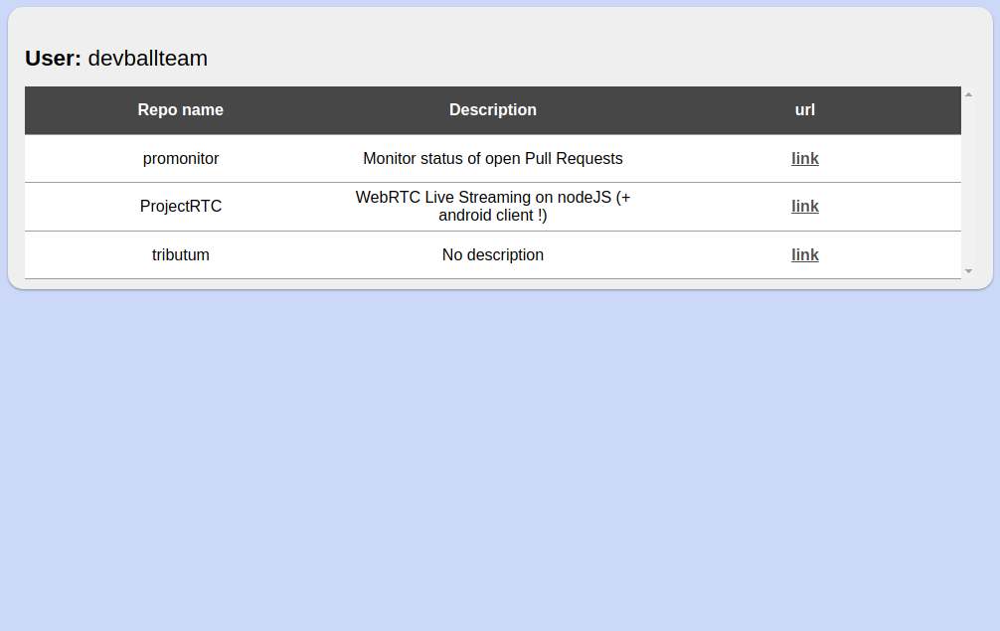

### 1. Run the app
Github API has the rate limiting set to 50 rpm for unauthorized users.
To raise rate limits up to 5000 rpm set the env variables for authorization.

* GIT_USR variable for your github username
* GIT_PASSWD variable for your github password / token

1. Clone the repository.
2. Run npm i to install the deps.
3. run GIT_USR=<your_username> GIT_PASSWD=<your_password/token> npx nodemon
4. visit localhost:8080
5. Open devtoos
6. Edit the body tag, placing <repos data-user="devballteam" data-update="2019-05-01">
7. Unfocus the body tag.

Yes, you can create a repos tag in whatever number with whatever data.
